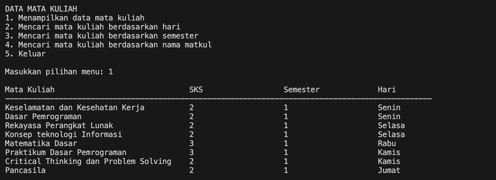

|  | Algorithm and Data Structure |
|--|--|
| NIM |  244107020173|
| Nama |  Regita Abelia Putri Satriyo |
| Kelas | TI - 1H |
| Repository | [link] (https://github.com/eternitvy/ALSD/tree/main/Jobsheet1) |

# Jobsheet 1

## 2.1 Pemilihan 

### 2.2.1 Praktikum Pemilihan 

hasil running praktikum pemilihan

* **penjelasan singkat**
* > Terdapat 6 step utama: 

    1. Menginput nilai tugas, kuis, UTS, UAS
    2. ⁠Pengecekan nilai input (0 - 100)
    3. ⁠Menghitung hasil nilai akhir
    4. ⁠Pengecekan nilai huruf
    5. Menentukan status kelulusan
    6. Mencetak hasil nilai akhir, nilai huruf, dan status kelulusan

## 2.2 Perulangan
 
### 2.3.1 Praktikum Perulangan

Hasil running praktikum perulangan

* **penjelasan singkat**
* > terdapat 8 step utama:

    1. Menginputkan NIM
    2. Pengecekan 2 digit terakhir dari NIM
    3. Jika n < 10, maka n dijumlahkan dengan 10
    4. Mencetak hasil n
    5. Perulangan dimulai dari i = 1 hingga i <= n
    6. Membuat kondisi jika (i == 6) atau (i == 8) akan dilanjut ke iterasi berikutnya
    7. Membuat kondisi jika i bilangan ganjil, mencetak "*" dan jika i bilangan genap, mencetak nilai i
    8. Mencetak hasil

## 2.3 Array

### 2.4.1 praktikum Array

Hasil running praktikum perulangan

* **Penjelasan singkat**
* > Terdapat 5 step utama: 

    1. Menginputkan nama mata kuliah, nilai tiap mata kuliah, dan SKS tiap mata kuliah
    2. Menghitung total SKS
    3. Pengecekan dan konversi nilai angka ke nilai huruf dan bobot nilai
    4. Menghitung total nilai bobot dan menghitung IP
    5. Mencetak hasil nama mata kuliah, nilai angka, nilai huruf, bobot nilai, dan IP

## 2.4 Fungsi

## 2.5.1 Praktikum Fungsi

Hasil running praktikum fungsi

* **Penjelasan singkat**
* > Terdapat 7 step utama:

    1. Meng-inisialisasi stok bunga tiap cabang dan harga tiap jenis bunga dengan variable global
    2. Menghitung pendapatan tiap cabang jika semua bunga terjual
    3. Mencetak hasil hitung total harga
    4. Menghitung total stok tiap jenis bunga
    5. Mencetak total stok
    6. Menghitung stok bunga yang mati pada cabang ke-4
    7. Mencetak hasil hitung stok bunga mati

## Tugas 1

Hasil running tugas 1

.png)

* **Penjelasan singkat**
* > Terdapat 5 step utama: 

    1. Meng-inisialisasi kode plat dan kota
    2. Menginputkan kode plat
    3. Konversi kode plat yang diinputkan menjadi uppercase
    4. Mencari indeks kode plat
    5. Mencetak hasil indeks yang ditemukan

## Tugas 2

Hasil running tugas 2

.png)

* **Penjelasan singkat**
* > Terdapat 5 step utama:

    1. Menampilkan menu pilihan
    2. Menginputkan pilihan
    3. Menginputkan panjang sisi
    4. Memanggil fungsi sesuai dengan pilihan
    5. Ulangi atau keluar

## Tugas 3

Hasil running tugas 3

* **Penjelasan singkat**
* > Terdapat 5 step utama:

    1. Menginputkan data mata kuliah (nama mata kuliah, SKS, semester, dan hari)
    2. Menampilkan menu pilihan
    3. Menginputkan pilihan
    4. Memanggil fungsi sesuai dengan pilihan
    5. Ulangi atau keluar

