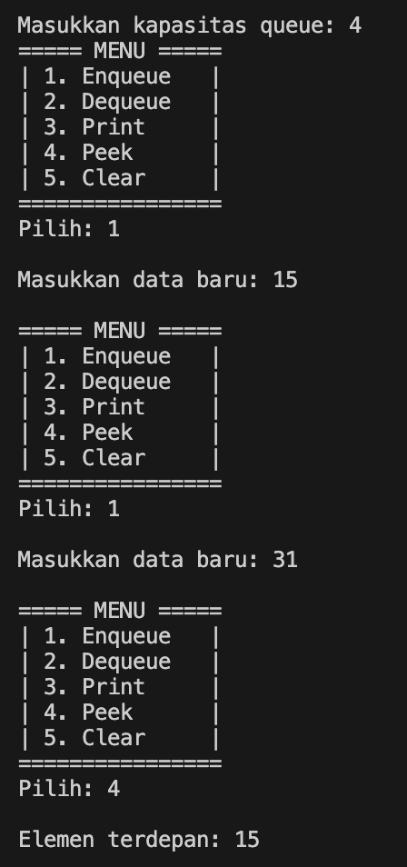
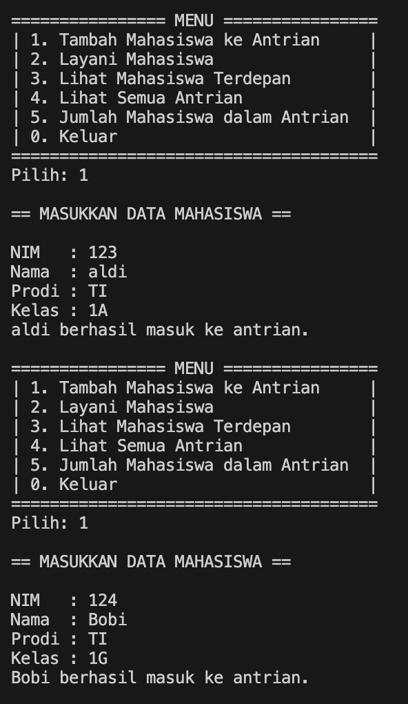
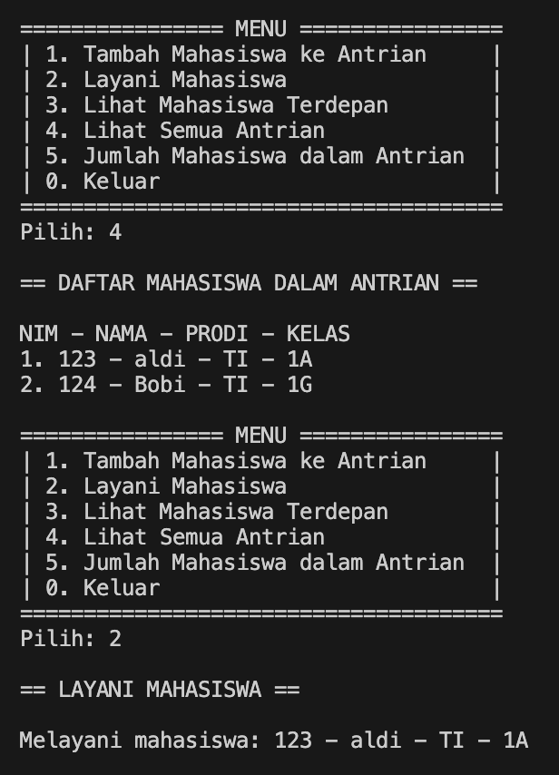
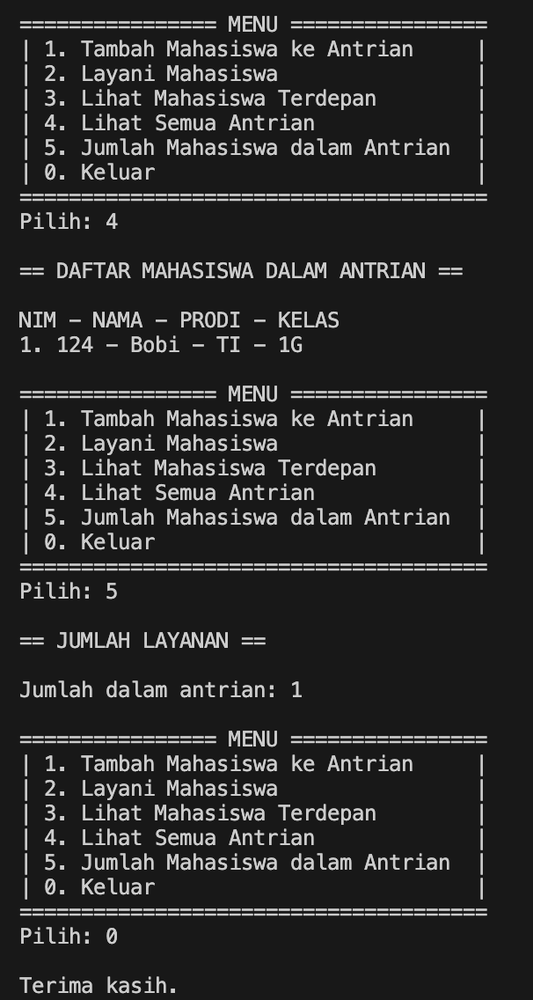
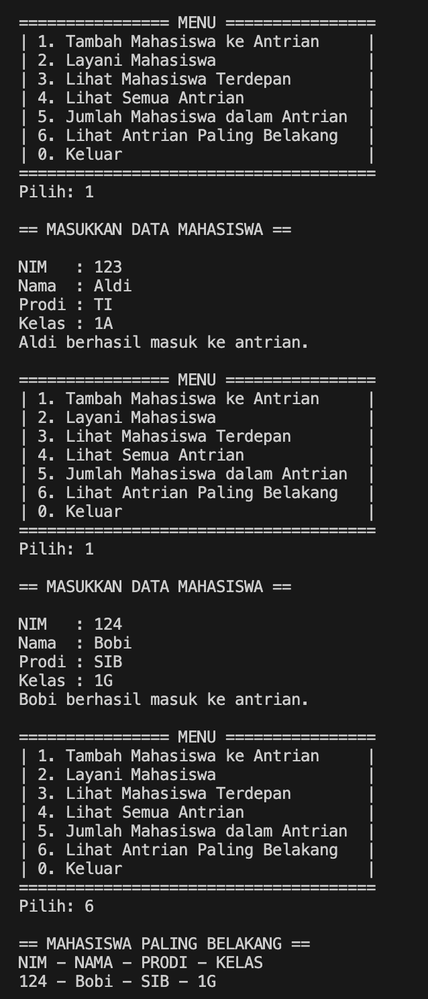

|  | Algorithm and Data Structure |
|--|--|
| NIM |  244107020173|
| Nama |  Regita Abelia Putri Satriyo |
| Kelas | TI - 1H |
| Repository | [link] (https://github.com/eternitvy/ALSD/tree/main/Jobsheet10) |
  

# Jobsheet 10 - QUEUE
  

## 2.1 Percobaan 1 - Operasi Dasar Queue

### 2.1.1 Langkah-langkah Percobaan

Menginputkan Kode Program sesuai perintah pada file 
- [Queue22.java](./sc_code/Queue22.java)
- [QueueMain22.java](./sc_code/QueueMain22.java)


### 2.1.2 Verifikasi Hasil Running



### 2.1.3 Pertanyaan :

1. Nilai `front` dan `rear` diinisialisasi -1 untuk menandakan bahkan queue masih kosong dan belum ada elemen, sedangkan `size` bernilai 0 untuk menandakan bahwa jumlah elemen dalam queue saat ini berjumlah 0

2. Kode program tersebut digunakan untuk mengimplementasikan jikq `rear` telah mencapai indeks terakhir (`max - 1`), makan `rear` akan di*reset* ke 0 agar antrian kembali ke awal array

3. Kode program tersebut digunakan untuk memastikan `front` berputatr kembali ke awal array saat telah mencapai ke indeks terakhir (`max - 1`)

4. Hal tersebut karena elemen pertama yang akan dicetak adalah elemen di indeks `front`

5. Kode program tersebut adalah langkah iterasi melingkar pada queue. Setelah `i` mencapai indeks terakhir (`max - 1`), akan mengembalikan `0`, sehingga bisa melanjutkan iterasi dari awal array

6. berikut adalah contoh kode program yang menunjukan queue overflow, dikarenakan queue yang di deklarasikan melebihi kapasitas yang telah ditentukan
```java
        Queue22 q = new Queue22(2);
        
        q.Enqueue(1);
        q.Enqueue(2);
        q.Enqueue(2);
```

7. Untuk menghentikan program, dapat menambahkan
```java
        if (isFull()) {
            System.out.println("Queue sudah penuh");
            System.exit(1);
```

pada method enqueue. Dan menambahkan 
```java
        if (isEmpty()) {
            System.out.println("Queue masih kosong");
            System.exit(1);
```

pada method dequeue

## 2.2 Percobaan 2 - Antrian Layanan Akademik

### 2.2.1 Langkah-langkah Percobaan

Menginputkan Kode Program sesuai perintah pada file 
- [Mahasiswa22.java](./sc_code/Mahasiswa22.java)
- [AntrianLayanan22.java](./sc_code/AntrianLayanan22.java)
- [LayananAkademikSIAKAD22.java](./sc_code/LayananAkademikSIAKAD22.java)

### 2.2.3 Verifikasi Hasil Running





### 2.2.4 Pertanyaan :

Menambahkan method lihatAkhir pada class [AntrianLayanan22.java](./sc_code/AntrianLayanan22)
```java
    public void lihatAkhir() {
        if (isEmpty()) {
            System.out.println("Antrian kosong.");
        } else {
            System.out.println("== MAHASISWA PALING BELAKANG ==");
            System.out.println("NIM - NAMA - PRODI - KELAS");
            data[rear].tampilkanData();
        }
    }
```

Memanggil method dan menambahkan case pada class [LayananAkademikSIAKAD22.java](./sc_code/LayananAkademikSIAKAD.java)
```java
                case 6:
                    antrian.lihatAkhir();
                    System.out.println();
                    break;
```

```java
 do {
            System.out.println("================ MENU ================");
            System.out.println("| 1. Tambah Mahasiswa ke Antrian     |");
            System.out.println("| 2. Layani Mahasiswa                |");
            System.out.println("| 3. Lihat Mahasiswa Terdepan        |");
            System.out.println("| 4. Lihat Semua Antrian             |");
            System.out.println("| 5. Jumlah Mahasiswa dalam Antrian  |");
            System.out.println("| 6. Lihat Antrian Paling Belakang   |");
            System.out.println("| 0. Keluar                          |");
            System.out.println("======================================");
```
### Hasil Running


## 2.3 Tugas

1. Membuat class sesuai perintah [Surat22.java](./sc_code/Surat22.java) untuk menyimpan atribut
2. Membuat class [StackSurat22.java](./sc_code/StackSurat22.java) untuk menyimpan method yang akan dijalankan
3. Membuat class [SuratDemo22.java](./sc_code/SuratDemo22.java) untuk membuat tampilan menu dan menjalankan method

#### Hasil Running


