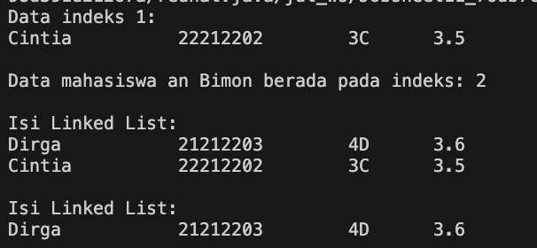

|  | Algorithm and Data Structure |
|--|--|
| NIM |  244107020173|
| Nama |  Regita Abelia Putri Satriyo |
| Kelas | TI - 1H |
| Repository | [link] (https://github.com/eternitvy/ALSD/tree/main/Jobsheet11) |
  

# Jobsheet 10 - LINKED LIST
  

## 2.1 Percobaan 1 - Pembuatan Single Linked List

### 2.1.1 Langkah-langkah Percobaan

Menginputkan Kode Program sesuai perintah pada file 
- [Mahasiswa22.java](./sc_code/Mahasiswa22.java)
- [Node22.java](./sc_code/Node22.java)
- [SingleLinkedList22.java](./sc_code/SingleLinkedList22.java)
- [SLLMain22.java](./sc_code/SLLMain22.java)


### 2.1.2 Verifikasi Hasil Running


### 2.1.3 Pertanyaan :

1. Karena pada saat method `print()` dipanggil, kondisi `isEmpty()` bernilai true yang menghasilkan `head == null`. Hal itu dikarenakan belum ada data terisi pada linked list saat `print()` dipanggil

2. variable `temp` pada method berfungsi sebagai petunjuk atau iterator node pada linked list

3. Agar data menjadi inputan, beberapa yang harus dimodifikasi adalah,

Menambahkan fungsi pada class [SLLMain.java](./sc_code/SLLMain22.java) yang berfungsi untuk menginputkan data 
```java
    public static Mahasiswa22 inputMhs(Scanner sc) {
        System.out.print("NIM    : ");
        String nim = sc.nextLine();
        System.out.print("Nama   : ");
        String nama = sc.nextLine();
        System.out.print("Kelas  : ");
        String kelas = sc.nextLine();
        System.out.print("IPK    : ");
        double ipk = sc.nextDouble();
        sc.nextLine();
        return new Mahasiswa22(nim, nama, kelas, ipk);
    }
```

Memanggil fungsi tersebut pada setiap case 
```java
            switch (pilih) {
                case 1:
                    sll.addFirst(inputMhs(sc));   
                    System.out.println();                 
                    break;
            
                case 2:
                    sll.addLast(inputMhs(sc));
                    System.out.println();
                    break;

                case 3:
                    System.out.println("== CARI NAMA ==");
                    System.out.println();
                    System.out.print("Masukkan nama mahasiswa: ");
                    String key = sc.nextLine();
                    sll.insertAfter(key, inputMhs(sc));
                    System.out.println();
                    break;

                case 4:
                    System.out.println("== CARI INDEKS ==");
                    System.out.println();
                    System.out.print("Masukkan indeks: ");
                    int indeksTambah = sc.nextInt();
                    sc.nextLine();
                    sll.insertAt(indeksTambah, inputMhs(sc));
                    System.out.println();
                    break;
```

### Hasil running


## 2.2 Percobaan 2 - Modifikasi Elemen Pada Single Linked List

### 2.2.1 Langkah-langkah Percobaan

Menginputkan Kode Program sesuai perintah pada file 
- [SingleLinkedList22.java](./sc_code/SingleLinkedList22.java)
- [SLLPercobaan2.java](./sc_code/SLLPercobaan2.java)

### 2.2.3 Verifikasi Hasil Running



### 2.2.4 Pertanyaan :
1. Digunakan `break` untuk menghentikan pencarian lebih lanjut dalam linked list setelah node yang ingin dihapus telah ditemukan dan telah dihapus

2. di baris pertama, digunakan untuk melompati node yang dihapus, sehingga node sebelumnya `temp` sekarang menunjuk ke node setelah node yang dihapus. di baris kedua, digunakan untuk memperbarui `tail` jika node yang dihapus adalah node terakhir.

## 2.3 Tugas

1. Membuat class sesuai perintah [LatihanMahasiswa22.java](./sc_code/LatihanMahasiswa22.java) untuk menyimpan atribut
2. Membuat class [LatihanAntrianKRS22.java](./sc_code/LatihanAntrianKRS22.java) untuk menyimpan method yang akan dijalankan
3. Membuat class [MainAntrianKRS22.java](./sc_code/MainAntrianKRS22.java) untuk membuat tampilan menu dan menjalankan method

#### Hasil Running


