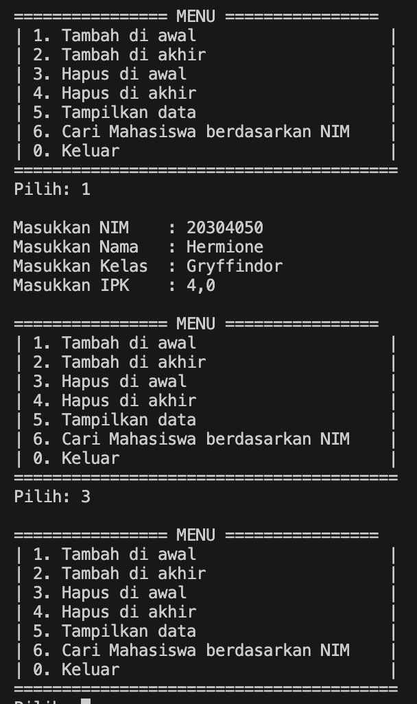
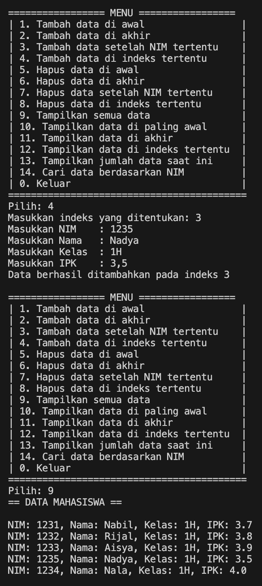

|  | Algorithm and Data Structure |
|--|--|
| NIM |  244107020173|
| Nama |  Regita Abelia Putri Satriyo |
| Kelas | TI - 1H |
| Repository | [link] (https://github.com/eternitvy/ALSD/tree/main/Jobsheet12) |
  

# Jobsheet 12 - DOUBLE LINKED LIST

## 12.2 Percobaan 1 

### 12.2.1 Langkah-langkah Percobaan

Menginputkan Kode Program sesuai perintah pada file 
- [Mahasiswa22.java](./sc_code/Mahasiswa22.java)
- [Node22.java](./sc_code/Node22.java)
- [DoubleLinkedList22.java](./sc_code/DoubleLinkedList22.java)
- [DLLMain22.java](./sc_code/DLLMain22.java)


### 12.2.2 Verifikasi Hasil Running


### 12.2.3 Pertanyaan :

1. - Single linked list : Node pada linked list hanya dapat menuju ke node berikutnya (_next_)
- Double linked list : Node pada linked list dapat menuju 2 node, node berkutnya (_next_) dan node sebelumnya (_prev_)

2. - Next : digunkan untuk petunjuk atau penggeser node ke node berikutnya
- Prev : digunakan untuk pentunjuk atau penggeser node ke node sebelumnya

3. Untuk menginisialisasi objek `DoubleLinkedList` dalam keadaan kosong

4. Jika linked list masih kosong, maka `newNode` akan menjadi `head` dan `tail`

5. Menghubungkan node lama (node yang sebelumnya menjadi head) ke newNode sebagai node sebelumnya (_prev_)

6. Modifikasi dengan menambahkan `if-else` pada method `print()`
```java
    public void print() {
        if (isEmpty()) {
            System.out.println("Linked list masih kosong! Tidak ada data yang ditampilkan");
        } 
        else {
            Node22 current = head;
            while (current != null) {
                current.data.tampil();
                current = current.next;
            }
        }
    }
```

7. Digunakan untuk menghungkan node baru ke node yang sebelumnya berada setelah current

8. memodifikasi menu pilihan dan switch-case agar fungsi `insertAfter()` masuk ke da;am menu pilihan

Menambahkan fungsi pada class [SLLMain.java](./sc_code/SLLMain22.java) yang berfungsi untuk menginputkan data 
```java
    public static Mahasiswa22 inputMhs(Scanner sc) {
        System.out.print("NIM    : ");
        String nim = sc.nextLine();
        System.out.print("Nama   : ");
        String nama = sc.nextLine();
        System.out.print("Kelas  : ");
        String kelas = sc.nextLine();
        System.out.print("IPK    : ");
        double ipk = sc.nextDouble();
        sc.nextLine();
        return new Mahasiswa22(nim, nama, kelas, ipk);
    }
```

## 12.3 Percobaan 2

### 12.3.1 Langkah-langkah Percobaan

Menginputkan Kode Program sesuai perintah pada file 
- [DoubleLinkedlist22.java](./sc_code/DoubleLinkedList22.java)

### 2.2.3 Verifikasi Hasil Running



### 2.2.4 Pertanyaan :
1. - ```java            head = head.next;``` digunakan untuk menggeser node head ke node selanjutnya
- ```java             head = head.next;``` digunakan untuk menghapus isi index head sebelumnya

2. Memodifikasi dengan menambahkan kode program berikut pada method ```removeFisrt()``` dan ```removeLast()```
```java
        Mahasiswa22 removed = head.data;
```
```java
        System.out.println("DATA BERHASIL DIHAPUS\n");
        System.out.println("Data yang dihapus: ");
        removed.tampil();
```

## 12.4 Tugas

- Menambahkan method pada class [DoublelinkedList22.java](./sc_code/DoubleLinkedList22.java)
- Memodifikasi menu pada class [DLLMain.java](./sc_code/DLLMain.java)

#### Hasil Running





