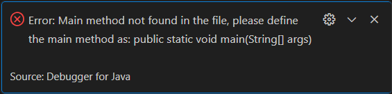
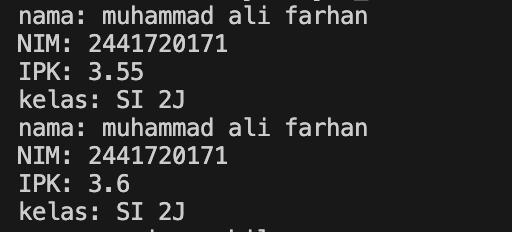
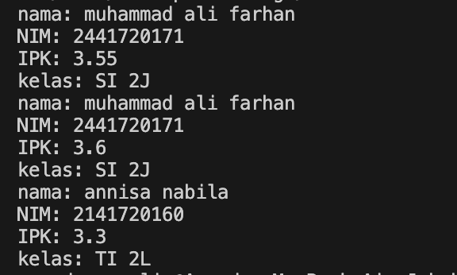
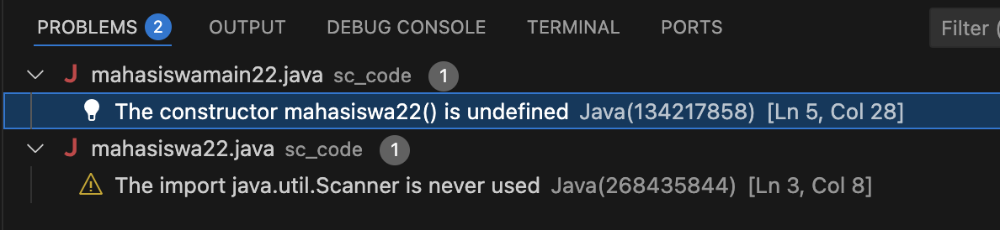
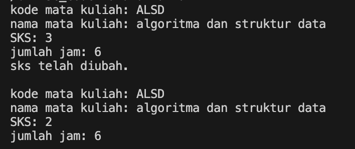
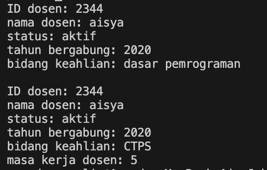

|  | Algorithm and Data Structure |
|--|--|
| NIM |  244107020173|
| Nama |  Regita Abelia Putri Satriyo |
| Kelas | TI - 1H |
| Repository | [link] () |
  

# Jobsheet 2 - Object
  

## 2.1 Percobaan 1 - Deklarasi Class, Atribut, dan Method


### 2.1.1 Langkah-langkah Percobaan


Menginputkan kode program [mahasiswa22.java](./sc_code/mahasiswa12.java)


### 2.1.2 Verifikasi Hasil




### 2.1.3 Pertanyaan :
1. Class : memiliki atribut dan method

	Object : memilki identitas dan method

2. Atribut yang dimiliki oleh class Mahasiswa ada 4, yaitu : Nama, NIM, Kelas, dan IPK.
  

3. ada 4 method
	- menampilkan informasi
	- mengubah kelas
	- pembaruan IPK
	- cek nilai kinerja


4. Menambahkan Syntax
```java
if (ipk <= 0 || ipk >= 4.0) {
        System.out.println("IPK tidak valid. Harus antara 0.0 dan 4.0");
    }
```

5. cara kerja method nilaikinerja adalah dengan mengevaluasi nilai IPK mahasiswa. nilaikinerja menggunakan bebrapa kondisi untuk menentukan nilai kinerja sesuai IPK yang diperoleh. beberapa kategori tersebut adalah nilai yang direturnkan jika kondisi terpenuhi.
  

## 2.2 Percobaan 2 - Instansiasi Object

### 2.2.1 Langkah-langkah 

Menginputkan kode program [mahasiswamain22.java](./sc_code/mahasiswa12.java)

### 2.2.2 Verifikasi Hasil



### 2.2.3 Pertanyaan :

1. baris yang digunakan untuk intansiasi 
```java
mahasiswa22 mhs1 = new mahasiswa22();
```
object yang dihasilkan adalah mhs1

2. atribut dapat diakses dengan menggunakan notasi titik (.), method juga diakses dengan notasi titik (.) dan diikuti dengan tanda kurung

3. pemanggilan method tampilkaninformasi() yang pertama adalah pemanggilan untuk menghasilkan outpun intansiasi pada atribut, sedangkan pemanggilan method tampilkaninformasi() kedua adalah pemanggilan untuk menghasilkan output setelah dijalankannya method ubahkelas() dan updateipk()
 
## 2.3 Percobaan 3 - Membuat Konstruktor

### 2.3.1 Langkah-langkah

Menambahkan syntax pada file [mahasiswa22.java](./sc_code/mahasiswa22.java) dan [mahasiswamain22.java](./sc_code/mahasiswamain22.java)

### 2.3.2 Verifikasi Hasil



### 2.3.3 Pertanyaan :

1. Baris kode program 
```java
public mahasiswa22(String nm, String nim, double ipk, String kls) {
        nama = nm;
        this.nim = nim;
        this.ipk = ipk;
        kelas = kls;
    }
```

2. Pada baris tersebut melakukan intansiasi pada objek 'mhs2' dengan menggunakan konstruktor berparameter.

3. Hasilnya : 

Error, Karena ketika konstruktor default pada class mahasiswa dihapus maka konstruktor berparameter yang menjadi konstruktor defaultnya.

4. Tidak harus berurutan!, Karena method dalam suatu class dapat diakses sesuai kebutuhan.

5. Membuat object baru
```java
mahasiswa22 mhsabl = new mahasiswa22("Regita Abelia Putri Satriyo", "244107020173", 3.54, "TI-1H");
```

## 2.4 Latihan Praktikum

### MATA KULIAH

1. Pada studi kasus ini terdapat dua class yaitu : [Matakuliah22.java](/sc_code/matakuliah22.java) dan [MatakuliahMain22.java](/sc_code/matakuliahmain22.java)

2. Hasil Running 

 .png)

### DOSEN

1. Pada studi kasus ini terdapat dua class yaitu : [Dosen22.java](/sc_code/dosen22.java) dan [DosenMain22.java](/sc_code/dosenmain22.java)

2. Hasil Running

 .png)