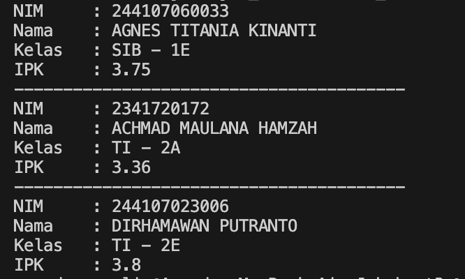
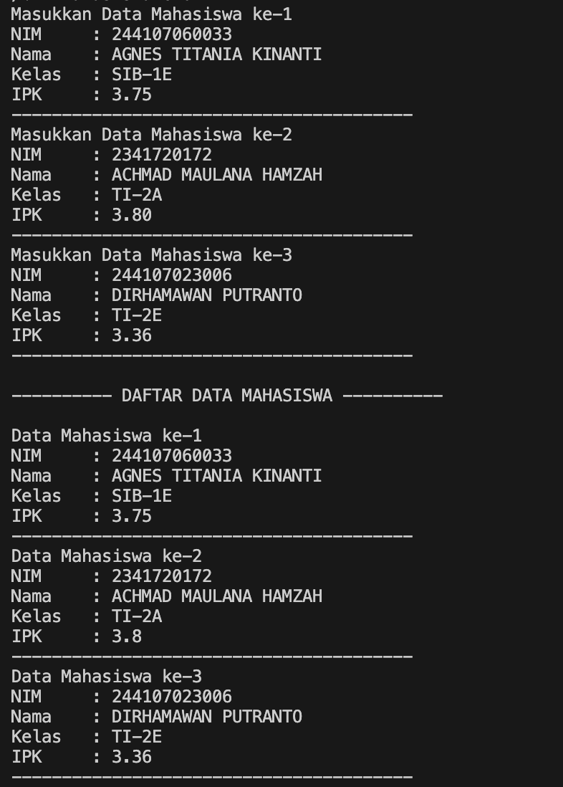
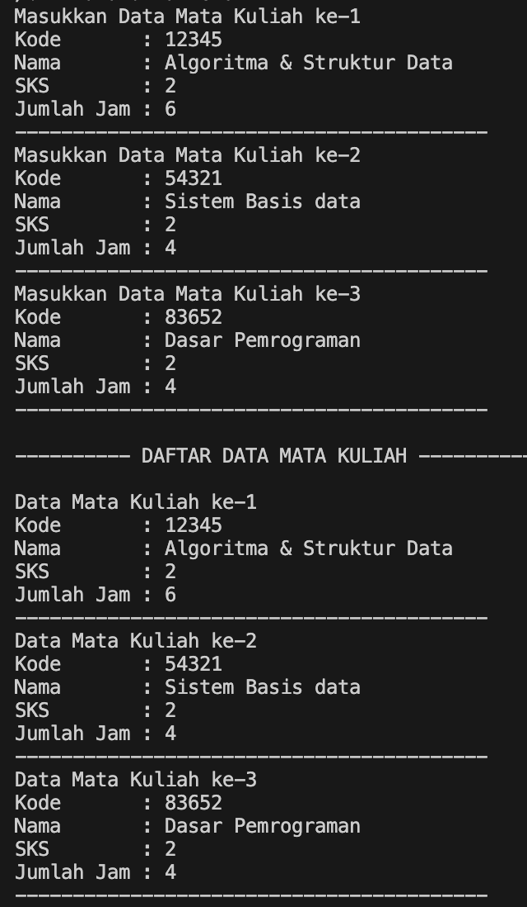
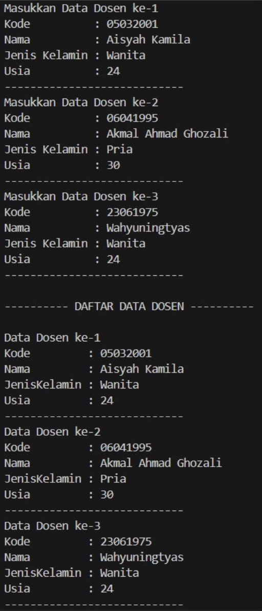

|  | Algorithm and Data Structure |
|--|--|
| NIM |  244107020173|
| Nama |  Regita Abelia Putri Satriyo |
| Kelas | TI - 1H |
| Repository | [link] (https://github.com/eternitvy/ALSD/tree/main/Jobsheet3) |
  

# Jobsheet 3 - Array Of Object
  

## 3.2 Percobaan 1 - Membuat Array dari Object, Mengisi dan Menampilkan


### 3.2.1 Langkah-langkah Percobaan


Menginputkan Kode Program sesuai perintah pada file [Mahasiswa22.java](./sc_code/Mahasiswa22.java) dan [MahasiswaDemo22.java](./sc_code/MahasiswaDemo22.java).


### 3.2.2 Verifikasi Hasil Running




### 3.2.3 Pertanyaan : 

1. Tidak harus, atribut dan method dalam array of object diperlukan sesuai kebutuhan.

2. Kode ini mendeklarasikan dan menginisialisasi array bernama arrayOfMahasiswa yang dapat menampung 3 objek dari kelas Mahasiswa.

3. Tidak, Pemanggilan tersebut bisa dilakukan karena jika sebuah class tidak memiliki konstruktor yang didefinisikan, Java secara otomatis menyediakan konstruktor default yang tidak mengambil argumen.

4. Menginisiasi array sesuai indeks yang dituju.

5. Class Mahasiswa digunakan untuk memberikan atribut/method pada object, sedangkan class MahasiswaDemo digunakan untuk memanggil class dan method yang terdapat pada class Mahasiswa.


## 3.3 Percobaan 2 - Menerima Input Isian Array Menggunakan Looping


### 3.3.1 Langkah-langkah Percobaan

Menginputkan Kode Program sesuai perintah pada class [Mahasiswa22.java](./sc_code/Mahasiswa22.java) dan [MahasiswaDemo22.java](./sc_code/MahasiswaDemo22.java).


### 3.3.2 Verifikasi Hasil Running




### 3.3.2 Pertanyaan :

1. Menambahkan method cetakinfo()
```java
public void cetakInfo() {
        System.out.println("NIM     : " + nim);
        System.out.println("Nama    : " + nama);
        System.out.println("Kelas   : " + kelas);
        System.out.println("IPK     : " + ipk);        
    }
```

2. error karena array baru myArrayOfMahasiswa tidak di inisiasi sehingga menyebabkan nullpointerexception
```java
Mahasiswa03[] myArrayOfMahasiswa03 = new Mahasiswa03[3];
        myArrayOfMahasiswa03[0].nim = "244107060033";
        myArrayOfMahasiswa03[0].nama = "AGNES TITANIA KINANTI";
        myArrayOfMahasiswa03[0].kelas = "SIB-1E";
        myArrayOfMahasiswa03[0].ipk = (float) 3.75;
```


## 3.4 Percobaan 3 - Constructor Berparameter


### 3.4.1 Langkah-langkah Percobaan

Menginputkan kode sesuai perintah pada class [MataKuliah22.java](./sc_code/MataKuliah22.java) dan class [MataKuliahDemo22.java](./sc_code/MataKuliahDemo22.java).


### 3.4.2 Verifikasi Hasil Running




### 3.4.3 Pertanyaan :

1. 1 class dapat memiliki lebih lebih dari 1 constructor, contohnya :
```java
public MataKuliah22() {
    }

    public MataKuliah22(String kode, String nama, int sks, int jmlJam) {
        this.kode = kode;
        this.nama = nama;
        this.sks = sks;
        this.jumlahJam = jumlahJam;
    }
```

2. Menambahkan method tambahData()

```java
void tambahData() {
        Scanner sc = new Scanner(System.in);
        System.out.print("Kode       : ");
        this.kode = sc.nextLine();
        System.out.print("Nama       : ");
        this.nama = sc.nextLine();
        System.out.print("SKS        : ");
        this.sks = sc.nextInt();
        System.out.print("Jumlah Jam : ");
        this.jumlahJam = sc.nextInt();
    }
``` 
Memanggil method tambahData()
```java
for (int i = 0; i < arrayOfMataKuliah.length; i++) {
            System.out.println("Masukkan Data Mata Kuliah ke-" + (i + 1));
            arrayOfMataKuliah[i] = new MataKuliah22();
            arrayOfMataKuliah[i].tambahData();
            System.out.println("-----------------------------------------");
        }
```

3. Menambahkan method cetakInfo()
```java
public void cetakInfo() {
        System.out.println("Kode       : " + this.kode);
        System.out.println("Nama       : " + this.nama);
        System.out.println("SKS        : " + this.sks);
        System.out.println("Jumlah jam : " + this.jumlahJam);

    }
```
memanggil method cetakInfo()
```java
for (int i = 0; i < arrayOfMataKuliah.length; i++) {
            System.out.println("Data Mata Kuliah ke-" + (i + 1));
            arrayOfMataKuliah[i].cetakInfo();
            System.out.println("-----------------------------------------");
        }
```

4. Memodifikasi kode program
```java
System.out.print("Masukkan jumlah data mata kuliah: ");
        int jumlahData = sc.nextInt();

        MataKuliah22[] arrayOfMataKuliah = new MataKuliah22[jumlahData];
```


## 3.5 Tugas

1. Membuat sebuah program untuk menampilkan informasi tentang dosen, dengan menerima input semua informasi terkait dosen dan menampilkannya ke layar. Terdiri dari 2 class : 
    - [Dosen22.java](./sc_code/Dosen22.java)
        
        Berisikan attribute informasi dosen, juga method berkonstruktor
    - [DosenDemo22.java](./sc_code/DosenDemo22.java)
        
        Class untuk proses input juga menampilkan data yang telah diinputkan
    

hasil running



2. Menambahkan class baru [DataDosen22](./sc_code/DataDosen22.java)

hasil running

inputan
.png)

outputan
.png)

method dataDosen
.png)

