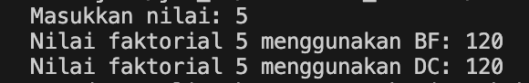
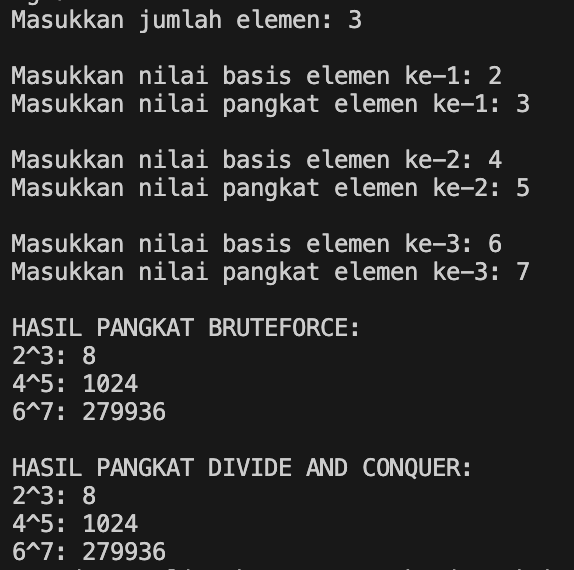
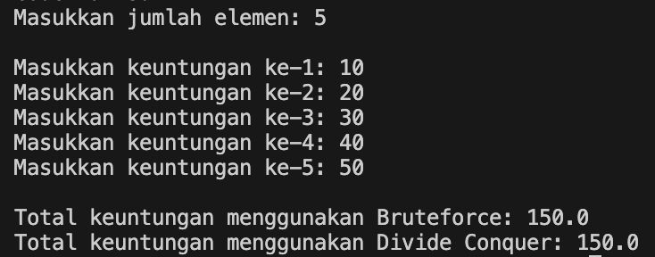
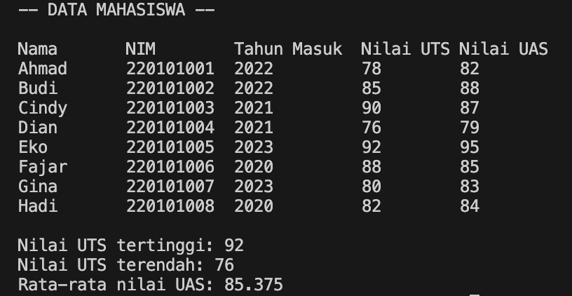

|  | Algorithm and Data Structure |
|--|--|
| NIM |  244107020173|
| Nama |  Regita Abelia Putri Satriyo |
| Kelas | TI - 1H |
| Repository | [link] (https://github.com/eternitvy/ALSD/tree/main/Jobsheet5) |
  

# Jobsheet 5 - brute Force dan Divide Conquer
  

## 5.2 Percobaan 1 - Menghitung Nilai Faktorial dengan Algoritma Brute Force dan Divide Conquer


### 5.2.1 Langkah-langkah Percobaan


Menginputkan Kode Program sesuai perintah pada file [Faktorial.java](./sc_code/Faktorial.java) dan [MainFaktorial.java](./sc_code/MainFaktorial.java).


### 5.2.2 Verifikasi Hasil Running




### 5.2.3 Pertanyaan : 

1. *if* adalah base case dari fungsi rekursif yang digunakan untuk menentukan kapan fungsi rekursif berhenti, sedangkan *else* adalah bagian dari fungsi rekursif yang digunakan agar program terus berjalan sampai memenuhi kondisi dari *if* (base case)

2. Memungkinkan, selain menggunakan *for* perulangan dapat dilakukan menggunakan *while*
``` java
int fakto = 1;
        int i = 1;
        while (i <= n) {
            fakto = fakto * i;
            i++;
        }
        return fakto;
```

3. Perbedaannya adalah cara perhitungannya. 
- *fakto *= i* digunakan pada FaktorialBF() karena method tersebut menggunakan fungsi iteratif yang pada algoritmanya menggunakan *i++* untuk mengubah variabel *i*
- *fakto = n * faktorialDC(n - 1)* digunakan pada FaktorialDC() karena method tersebut menggunakan fungsi rekursif (fungsi yang memanggil fungsi itu sendiri), sehingga pada algoritmanya menggunakan *n - 1* untuk mengubah variabel n

4. - FaktorialBF() menggunakan method fungsi iteratif
   - FaktorialCD() menggunakan method fungsi rekursif (fungsi yang nemanggil fungsi itu sendiri)

## 5.3 Percobaan 2 - Menghitung Hasil Pangkat dengan Algoritma Brute Force dan Divide Conquer


### 5.3.1 Langkah-langkah Percobaan

Menginputkan Kode Program sesuai perintah pada class [Pangkat.java](./sc_code/Pangkat.java) dan [MainPangkat.java](./sc_code/MainPangkat.java).


### 5.3.2 Verifikasi Hasil Running




### 5.3.2 Pertanyaan :

1. - method pangkatBF() menggunakan fungsi iteratif
   - method pangkatCD() menggunakan fungsi rekursif dengan logika pembagian *n* (pangkat)

2. sudah
```java
if (n % 2 == 1) {
    return (pangkatDC(a, n / 2) * pangkatDC(a, n / 2) * a);
}
else {
    return(pangkatDC(a, n / 2) * pangkatDC(a, n / 2));
}
```

3. Method pangkatBF() dapat dijalankan tanpa parameter, karena pada class Pangkat sudah terdapat atribut *nilai* dan *pangkat*
``` java
int pangkatBF() {
    int hasil = 1;
    for(int i = 0; i < pangkat; i++) {
        hasil = hasil * nilai;
    }
    return hasil;
}
```

Mengubah pada class MainPangkat
```java
System.out.println(p.nilai + "^" + p.pangkat + ": " + p.pangkatBF());
```

4.  pangkatBF()
    - menggunakan perulangan
    - menginisialisasi *hasil = 1*
    - perulangan akan berjalan sebanyak *n (pangkat)*, dan setiap iterasi variabel **hasil** akan dikalikan dengan *a*
    - setelah memenuhi kondisi perulangan, perulangan akan berhenti dan meng-*return*kan hasil *a* berpangkat *n*

    pangkatDC()
    - menggunakan fungsi rekursif
    - jika *n == 1*, maka hasil perhitungan adalah *a*
    - jika *n* adalah genap, program menghitung pangkatDC(a, n/2) dua kali dan mengalikan hasilnya
    - jika *n* adalah ganjil, program menghitung pangkatDC(a, n/2) dua kali dan mengalikan hasil tersebut dengan *a* tambahan

## 5.4 Percobaan 3 - Menghitung Sum Array dengan algoritma Brute Force dan Divide Conquer


### 5.4.1 Langkah-langkah Percobaan

Menginputkan kode sesuai perintah pada class [Sum.java](./sc_code/Sum.java) dan class [MainSum.java](./sc_code/MainSum.java).


### 5.4.2 Verifikasi Hasil Running




### 5.4.3 Pertanyaan :

1. *mid* digunakan untuk membagi array menjadi 2 bagian untuk pendekatan rekursif dalam menghitung total

2. - *lsum* digunakan untuk menghitung total array dari kiri
   - *rsum* digunakan untuk menghitung total array dari kanan

3. untuk mendapatkan total keseluruhan dari array, karena *lsum* dan *rsum* digunakan hanya pemisah agar perhitungan dilakukan secara efisien dan terstruktur

4. base case dari TotalDC()
``` java 
if (l == r) {
    return arr[l];
}
```

5. - totalDC() menggunakan fungsi rekursif untuk menghitung jumlah elemen dalam array dengan membagi array menjadi dua bagian *lsum* dan *rsum*
- program akan terus berjalan hingga mencapai base case, dan kemudian menjumlahkan hasil dari kedua bagian *lsum* dan *rsum* untuk memberikan total keseluruhan


## 4.5 Tugas

    - [Mahasiswa.java](./sc_code/Mahasiswa.java)
        
    - [MainMahasiswa.java](./sc_code/MainMahasiswa.java)
    

hasil running

