|  | Algorithm and Data Structure |
|--|--|
| NIM |  244107020173|
| Nama |  Regita Abelia Putri Satriyo |
| Kelas | TI - 1H |
| Repository | [link] (https://github.com/eternitvy/ALSD/tree/main/Jobsheet6) |
  

# Jobsheet 6 - SORTING (BUBBLE, SELECTION, DAN INSERTION SORT)
  

## 6.2 Percobaan 1 - Mengimplementasikan Sorting menggunakan object

#### A. SORTING - BUBBLE SORT

### 6.2.1 Langkah-langkah Percobaan


Menginputkan Kode Program sesuai perintah pada file [Sorting22.java](./sc_code/Sorting22.java) dan [SortingMain22.java](./sc_code/SoertingMain22.java).


### 6.2.2 Verifikasi Hasil Running

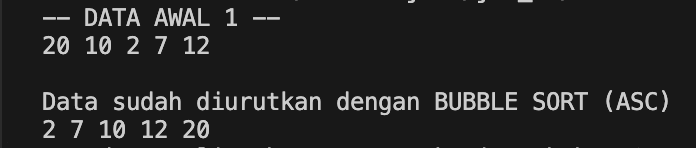


#### B. SORTING - SELECTION SORT

Menambahkan kode program sesuai perintah pada fila [Sorting22.java](./sc_code/Sorting22.java)
```java
void SelectionSort() {
    for (int i = 0; i < jumData; i++) {
        int min = i;
        for (int j = i + 1; j < jumData; j++) {
            if (data[j] < data[min]) {
                min = j;
            }
        }
        int temp = data[i];
        data[i] = data[min];
        data[min] = temp;
    }
}
```

Menambahkan kode program sesuai perintah pada file [SortingMain.java](./sc_code/SortingMain22.java)
```java
int b[] = {30, 20,2, 8, 14};
    Sorting22 dataurut2 = new Sorting22(b, b.length);
        
    System.out.println("-- DATA AWAL 2 --");
    dataurut2.tampil();
    dataurut2.SelectionSort();
    System.out.println();
    System.out.println("Data sudah diurutkan dengan SELECTION SORT (ASC)");
    dataurut2.tampil();
    System.out.println("---------------------------------------------");
    System.out.println();
```

### 6.2.3 Verifikasi Hasil Running

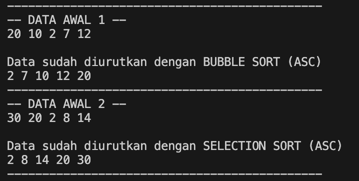

#### C. SORTING - INSERTION SORT

Menambahkan kode program sesuai perintah pada file [Sorting22.java](./sc_code/Sorting22.java)
```java
void insertionSort() {
    for (int i = 1; i < data.length - 1; i++) {
        int temp = data[i];
        int j = i - 1;
        while (j >= 0 && data[j] > temp) {
            data[j + 1] = data[j];
            j--;
        }
        data[j + 1] = temp;
    }
}
```
Menambahkan kode program sesuai perintah pada file [SortingMain.java](./sc_code/SortingMain22.java)
```java
int c[] = {40, 10, 4, 9, 3};
    Sorting22 dataurut3 = new Sorting22(c, c.length);
        
    System.out.println("-- DATA AWAL 3 --");
    dataurut3.tampil();
    dataurut3.insertionSort();
    System.out.println();
    System.out.println("Data sudah diurutkan dengan INSERTION SORT (ASC)");
    dataurut3.tampil();
    System.out.println("---------------------------------------------");
```

### 6.2.4 Verfikasi Hasil Running

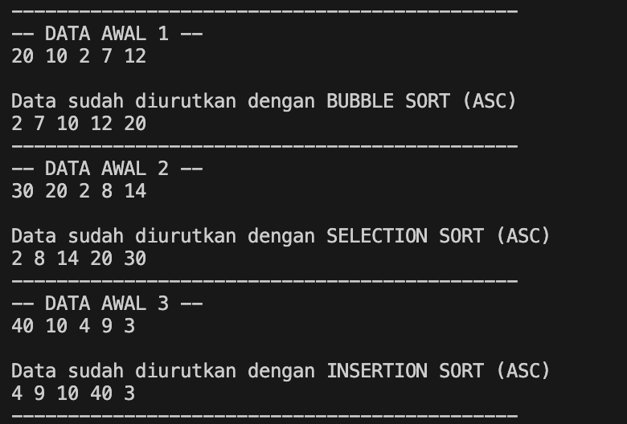

### 6.2.5 Pertanyaan : 

1. berfungsi untuk membandingkan dua elemen yang berdekatan dalam sebuah array `data[j - ]` dan `data[j]` lalu menukar posisinya jika elemen pertama lebih besar dari elemen kedua. Tujuannya untuk mengurutkan array dalam urutan ascending

2. Algoritma pencarian nilai minimum pada selection sort
```java
for (int j = i + 1; j < jumData; j++) {
    if (data[j] < data[min]) {
        min = j;
    }
}
```

3. Untuk menemukan posisi yang tepat untuk elemen `temp` di bagian array yang sudah diurutkan

4. Untuk menggeser elemen yang lebih besar dari elemen yang sedang disisipkan satu posisi ke kanan. Tujuannya untuk membuat ruang kosong di posisi yang tepat untuk elemen `temp`

## 6.3 Percobaan 2 - Sorting Menggunakan Array of Object


### 6.3.1 Langkah-langkah Percobaan

Menginputkan Kode Program sesuai perintah pada class 
- [Mahasiswa22.java](./sc_code/Mahasiswa22.java)
- [MahasiswaBerprestasi22](./sc_code/MahasiswaBerprestasi22.java)
- [MahasiswaDemo22.java](./sc_code/MahasiswaDemo22.java)


### 6.3.3 Verifikasi Hasil Running

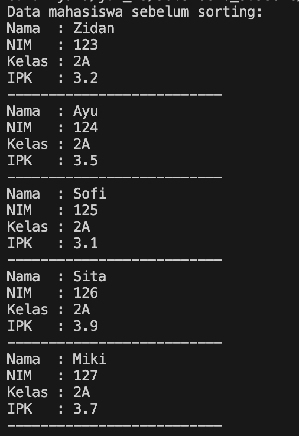
.png)


### 6.3.4 Pertanyaan :

1. pada kode program
```java
    for (int i = 0; i < jumData; i++) {
        for (int j = 1; j < jumData; j++) {
```
a. menggunakan `i < listMhs.length - 1` agar perulangan tidak melebihi batas indeksa array, sehingga saat `i` mencapai `listMhs - 1`, perulangan berhenti kaarena tidak ada lagi elemen yang perlu dibandingkan

b. menggunakan `j < listMhs - i` agar perulangan `j` hanya membandingkan elemen yang belum pada posisi yang benar, seiring berjalannya iterasi `i`

c. jika `listMhs.length = 50`, maka perulangan akan berlangsung sebanyak 49 kali, dan tahan *bubble sort* yang ditempuh ada 49 tahap

2. - memodifikasi class [MahasiswaBerprestasi22.java](./sc_code/MahasiswaBerprestasi22.java) dengan menambahkan method baru untuk menginisialisasi jumlah indeks pada array `listMhs`
```java
void initializelist(int size) {
        listMhs = new Mahasiswa22[size];
    }
```

- memodifikasi class [MahasiswaDemo22.java](./sc_code/MahasiswaDemo22.java) dengan menambah inputan `jmlMhs` untuk mengatur berapa banyak mahasiswa yang ingin diinput, memanggil method `initializelist()`, dan membuat perulangan untuk menginput data mahasiswa
```java
    System.out.print("Masukkan jumlah mahasiswa: ");
        int jmlMhs = sc.nextInt();
        sc.nextLine();
        System.out.println();

        list.initializelist(jmlMhs);

        for (int i = 0; i < jmlMhs; i++) {
            System.out.println("Masukkan data mahasiswa ke-" + (i + 1));
            System.out.print("NIM   : ");
            String nim = sc.nextLine();
            
            System.out.print("Nama  : ");
            String nama = sc.nextLine();
            
            System.out.print("Kelas : ");
            String kelas = sc.nextLine();
            
            System.out.print("IPK   : ");
            double ipk = sc.nextDouble();
            sc.nextLine();
            
            Mahasiswa22 m = new Mahasiswa22(nim, nama, kelas, ipk);
            list.tambah(m);
        }
```

#### hasil output running
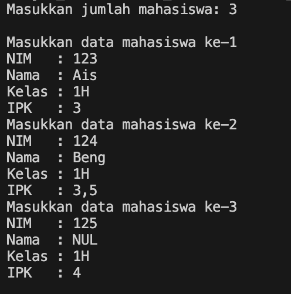
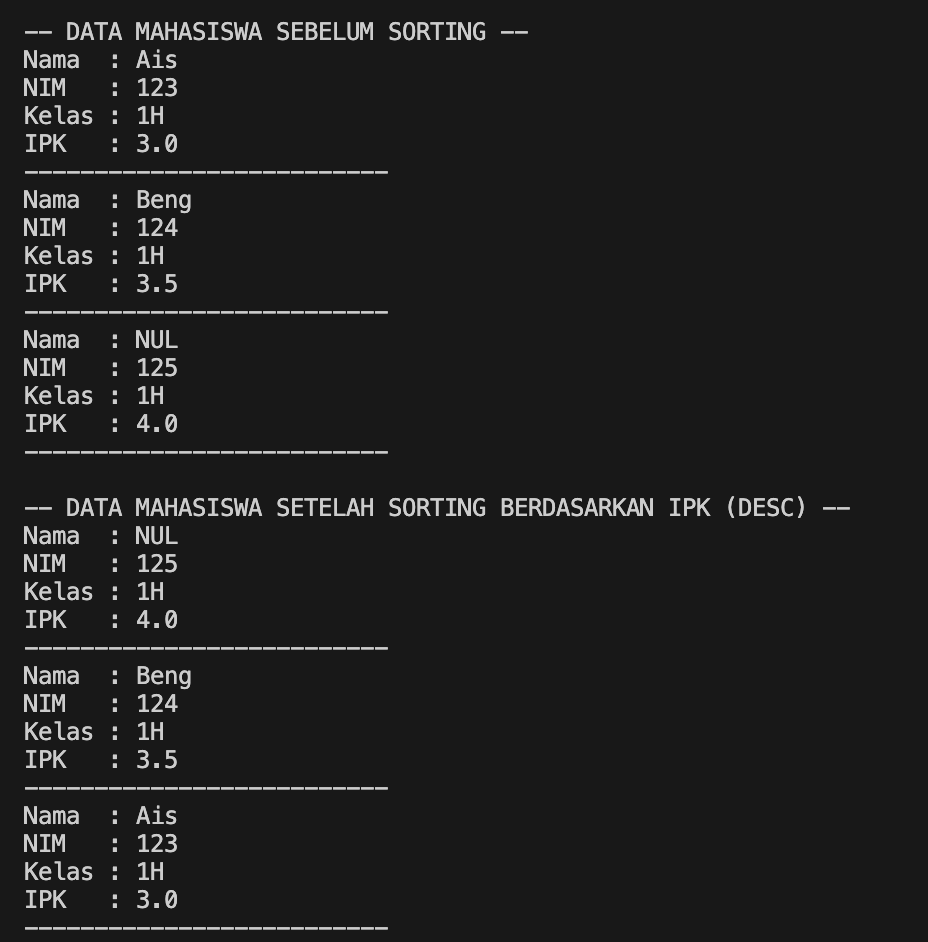

## 6.3.5 Mengurutkan Data Mahasiswa Berdasarkan IPK (Selection Sort)


### 6.3.1 Langkah-langkah Percobaan

Menambahkan method sesuai perintah pada file class [MahasiswaBerprestasi22.java](./sc_code/MahasiswaBerprestasi22.java)
```java
    void SelectionSort() {
        for (int i = 0; i < listMhs.length - 1; i++) {
            int idxMin = i;
            for (int j = i + 1; j < listMhs.length; j++) {
                if (listMhs[j].ipk < listMhs[idxMin].ipk) {
                    idxMin = j;
                }
            }
            Mahasiswa22 tmp = listMhs[idxMin];
            listMhs[idxMin] = listMhs[i];
            listMhs[i] = tmp;
        }
    }
```

Menambahkan kode program untuk memanggil method `selectionSort()` sesuai perintah pada class [MahasiswaDemo22.java](./sc_code/MahasiswaDemo22.java)

```java
        System.out.println("-- DATA MAHASISWA SETELAH SORTING SELECTION SORT (ASC) --");
        list.SelectionSort();
        list.tampil();
```

### 5.3.6 Verifikasi Hasil Running

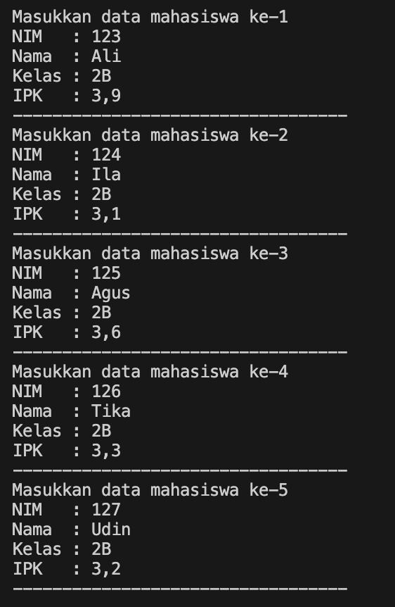
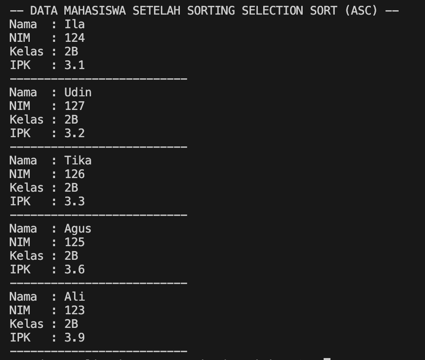


### 5.3.7 Pertanyaan :

1. kode program tersebut digunakan untuk menemukan elemen terkecil dari sub array. setelah itu, elemen terkecil ditukar dengan elemen pada indeks `i` dan proses perulangan terus berlanjut hingga elemen array terurut


## 6.4 Mengurutkan Data Mahasiswa Berdasarkan IPK Menggunakan Insertion Sort

### 6.4.1 Langkah-langkah Percobaan

Menambahkan kode program sesuai perintah pada file [MahasiswaBerprestasi22.java](./sc_code/MahasiswaBerprestasi22.java)
```java
    void insertionSort() {
        for (int i = 1; i < listMhs.length; i++) {
            Mahasiswa22 temp = listMhs[i];
            int j = i;
            while (j > 0 && listMhs[j - 1].ipk > temp.ipk) {
                listMhs[j] = listMhs[j - 1];
                j--;
            }
            listMhs[j] = temp;
        }
    }
```

Menambahkan kode program sesuai perintah pada file [MahasiswaDemo22.java](./sc_code/MahasiswaDemo22.java)
```java
        System.out.println("-- DATA MAHASISWA SETELAH SORTING INSERTION SORT (ASC) --");
        list.insertionSort();
        list.tampil();
```

### 6.4.2 Verifikasi Hasil Running

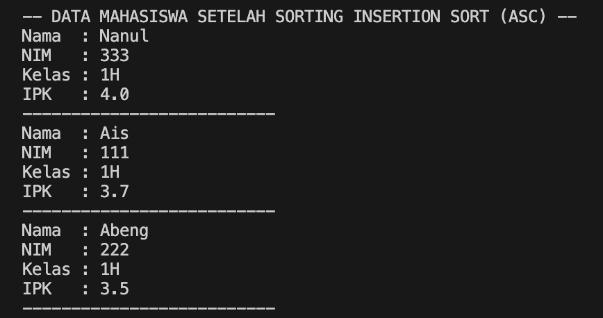

### Pertanyaan :
```java
    // Pertanyaan : mengubah proses sorting menjadi descending
    void insertionSort() {
        for (int i = 1; i < listMhs.length; i++) {
            Mahasiswa22 temp = listMhs[i];
            int j = i;
            while (j > 0 && listMhs[j - 1].ipk < temp.ipk) {
                listMhs[j] = listMhs[j - 1];
                j--;
            }
            listMhs[j] = temp;
        }
    }
```

#### Hasil Running
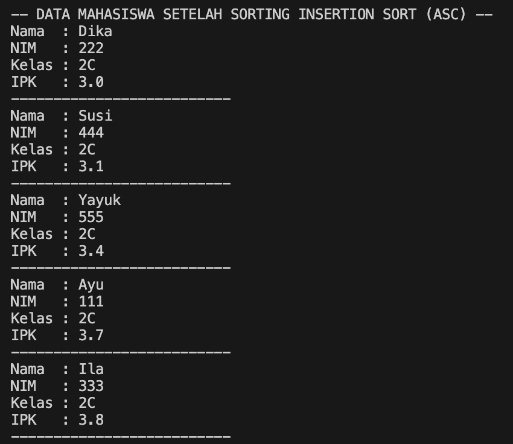

## 5.5 Tugas

1. Membuat class sesuai perintah [Dosen22.java](./sc_code/Dosen22.java) untuk menyimpan atribut dosen
2. Membuat class [DataDosen22.java](./sc_code/DataDosen22.java) untuk menyimpan method yang akan dijalankan
3. Membuat class [DosenMain22.java](./sc_code/DosenMain22.java) untuk membuat tampilan menu dan menjalankan method

#### Hasil Running

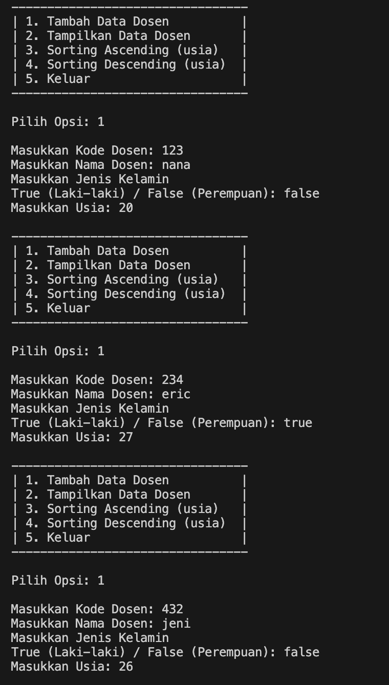
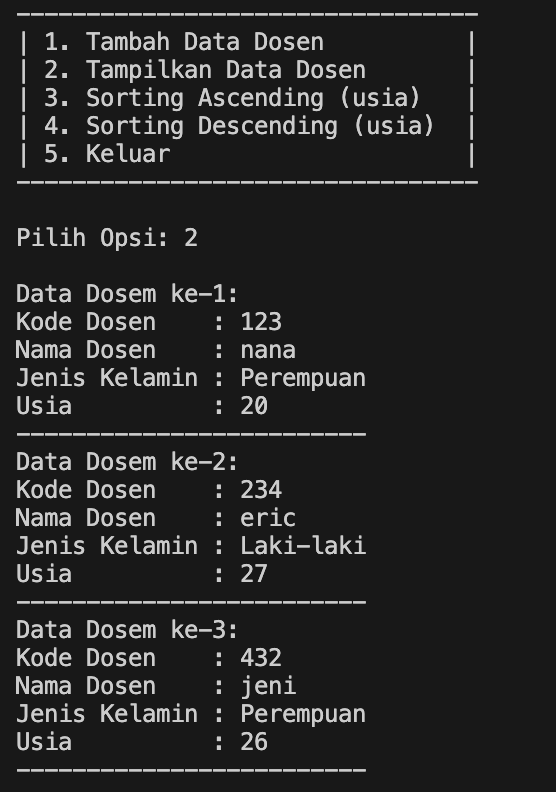
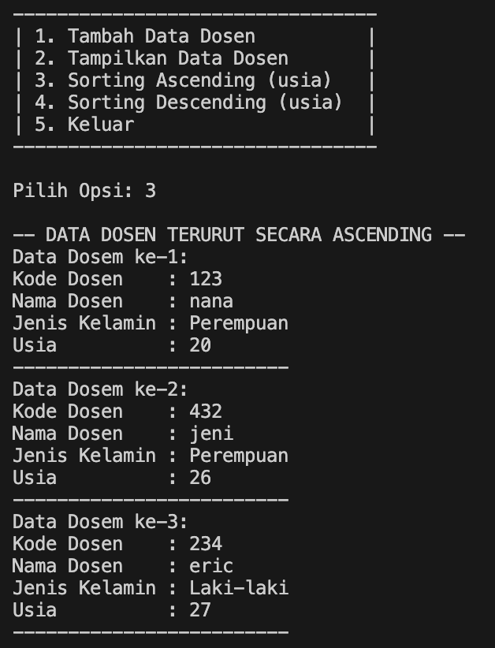
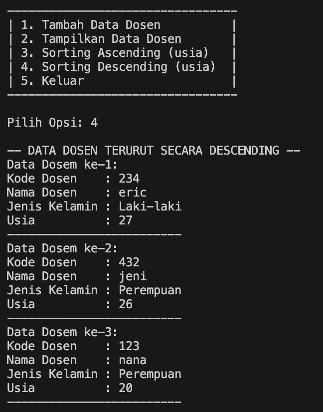
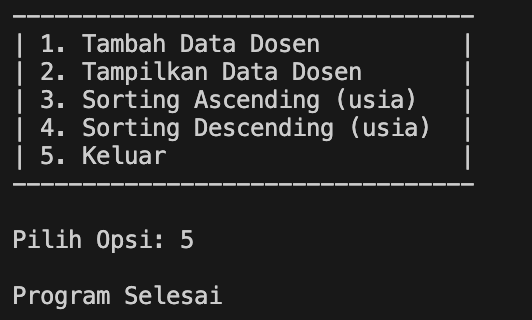
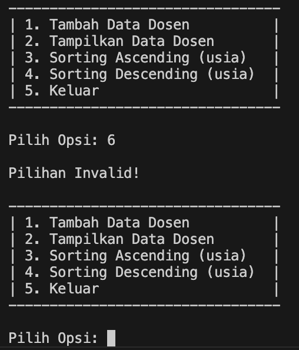