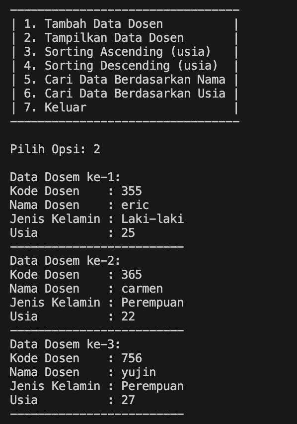
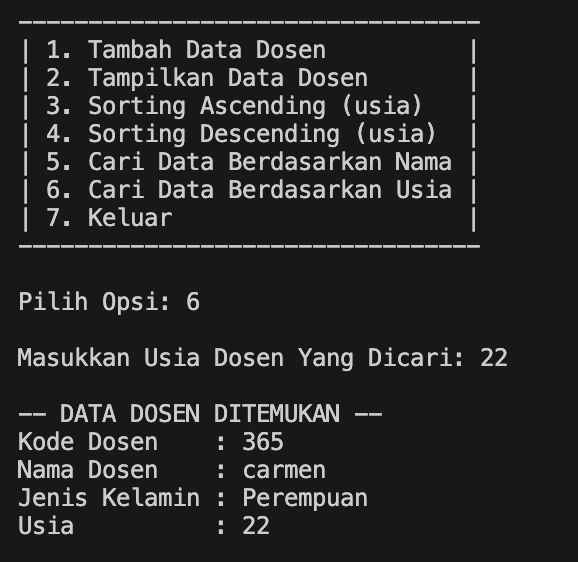

|  | Algorithm and Data Structure |
|--|--|
| NIM |  244107020173|
| Nama |  Regita Abelia Putri Satriyo |
| Kelas | TI - 1H |
| Repository | [link] (https://github.com/eternitvy/ALSD/tree/main/Jobsheet7) |
  

# Jobsheet 7 - SEARCHING
  

## 6.2 Percobaan 1 - Searching / Pencarian Menggunakan Algoritma Sequential Search

### 6.2.1 Langkah-langkah Percobaan


Menginputkan Kode Program sesuai perintah pada file 
- [mahasiswa22.java](./sc_code/mahasiswa.java)
- [mahasiswaberprestasi22.java](./sc_code/mahasiswaberprestasi22.java)
- [mahasiswademo22.java](./sc_code/mahasiswademo22.java)


### 6.2.2 Verifikasi Hasil Running


.png)
.png)

### 6.2.3 Pertanyaan :

1. - method `tampilposisi()` digunakan untuk menampilkan informasi posisi (indeks) dari ipk yang  dicari
   - method `tampildatasearch()` digunakan untuk menampilkan detail lengkap data mahasiswa dari ipk yang dicari, detail tersebut termasuk nim, nama, kelas, dan ipk, jika data ditemukan.

2.  untuk menghentikan perulangan ketika data (IPK) yang cari telah ditemukan

## 6.3 Percobaan 2 - Searching / Pencarian Menggunakan Binary Search

### 6.3.1 Langkah-langkah Percobaan

Menambahkan kode program sesuai perintah pada file [mahasiswaberprestasi22.java](./sc_code/mahasiswaberprestasi22.java)
```java
    int findbinarysearch(double cari, int left, int right) {
        int mid;
        if (right >= left) {
            mid = (left + right) / 2;
            if (cari == listmhs[mid].ipk) {
                return (mid);
            }
            else if (listmhs[mid].ipk > cari) {
                return findbinarysearch(cari, left, mid -1);
            }
            else {
                return findbinarysearch(cari, mid + 1, right);
            }
        }
        return -1;
    }
```

Menambahkan kode program sesuai perintah pada file [mahasiswademo22.java](./sc_code/mahasiswademo22.java)
```java
        System.out.println("-- MENGGUNAKAN BINARY SEARCH --");
        double posisi2 = list.findbinarysearch(cari, 0, jmlmhs-1);
        int pss2 = (int)posisi2;
        list.tampilposisi(cari, pss2);
        list.tampildatasearch(cari, pss2);
```

### 6.3.3 Verifikasi Hasil Running


### 6.3.4 Pertanyaan :

1. proses divide terdapat pada kode program
```java
mid = (left + right) / 2;
```
2. proses conquer terdapat pada kode program
```java
            if (cari == listmhs[mid].ipk) {
                return (mid);
            }
            else if (listmhs[mid].ipk > cari) {
                return findbinarysearch(cari, left, mid -1);
            }
            else {
                return findbinarysearch(cari, mid + 1, right);
            }
```

3. tidak berjalan, hal ini dikarenakan sesuai proses conquer diatas. kita akan menentukan langkah selanjutnya dengan pengecekan nilai tengan dari array tersebut, apakah nilai tengan lebih besar atau lebih kecil dari nilai yang dicari

4. algoritma tetap tidak bekerja, hal ini karena pengecekan pada proses conquer hanya bekerja untuk urutan ascending. sehingga dapat dimodifikasi seperti: 
```java
    int findbinarysearch(double cari, int left, int right) {
        int mid;
        if (right >= left) {
            mid = (left + right) / 2;
            if (cari == listmhs[mid].ipk) {
                return mid;
            }
            else if (listmhs[mid].ipk < cari) {
                return findbinarysearch(cari, left, mid - 1);
            }
            else {
                return findbinarysearch(cari, mid + 1, right);
            }
        }
        else {
            return -1;
        }
    }
```

5. dengan menambahkan method pada file [mahasiswaberprestasi22.java](./sc_code/mahasiswaberprestasi22.java) 
```java
    void initializelist(int size) {
        listmhs = new mahasiswa22[size];
    }
```

dan menambahkan kode program pada file [mahasiswademo22.java](./sc_code/mahasiswademo22.java)
```java
        System.out.print("Masukkan jumlah mahasiswa: ");
        int jmlmhs = sc.nextInt();
        sc.nextLine();
        System.out.println();

        list.initializelist(jmlmhs);
```

#### hasil output running


## 5.5 Tugas

1. Membuat class sesuai perintah [dosen22.java](./sc_code/dosen22.java) untuk menyimpan atribut dosen
2. Membuat class [datadosen22.java](./sc_code/datadosen22.java) untuk menyimpan method yang akan dijalankan
3. Membuat class [dosenmain22.java](./sc_code/dosenmain22.java) untuk membuat tampilan menu dan menjalankan method

#### Hasil Running






