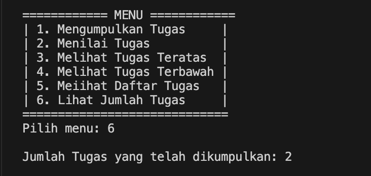
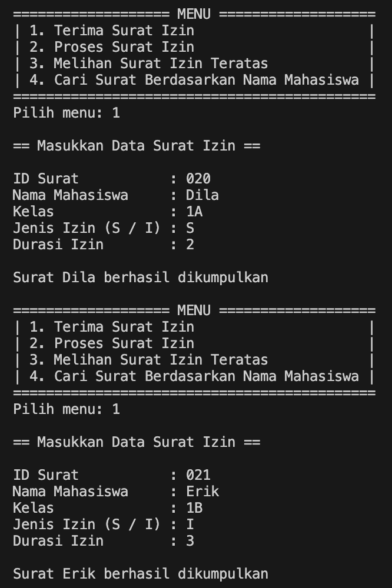

|  | Algorithm and Data Structure |
|--|--|
| NIM |  244107020173|
| Nama |  Regita Abelia Putri Satriyo |
| Kelas | TI - 1H |
| Repository | [link] (https://github.com/eternitvy/ALSD/tree/main/Jobsheet9) |
  

# Jobsheet 9 - STACK
  

## 2.1 Percobaan 1 - Mahasiswa Mengumpulkan Tugas

### 6.2.1 Langkah-langkah Percobaan

Menginputkan Kode Program sesuai perintah pada file 
- [Mahasiswa22.java](./sc_code/Mahasiswa22.java)
- [StackTugasMahasiswa22.java](./sc_code/StackTugasMahasiswa22.java)
- [MahasiswaDemo22.java](./sc_code/MahasiswaMemo22.java)


### 6.2.2 Verifikasi Hasil Running


### 6.2.3 Pertanyaan :

1. beberapa yang perlu diubah:
```java
    public void push(Mahasiswa22 mhs) {
        if (!isFull()) {
            top++;
            stack[top] = mhs;
        }
        else {
            System.out.println("Stack penuh! Tidak bisa menambahkan tugas lagi.");
        }
    }
```
```java
    public Mahasiswa22 pop() {
        if (!isEmpty()) {
            Mahasiswa22 m = stack[top];
            top--;
            return m;
        }
        else {
            System.out.println("Stack kosong! Tidak ada tugas untuk dinilai.");
            return null;
        }
    }
```
```java
    public Mahasiswa22 peek() {
        if (!isEmpty()) {
            return stack[top];
        }
        else {
            System.out.println("Stack kosong! Tidak ada tugas yang dikumpulkan.");
            return null;
        }
    }
```

### hasil running yang benar


2. Ada 5 data tugas yang dapat ditampung dalam stack
```java
        StackTugasMahasiswa22 stack = new StackTugasMahasiswa22(5);
```

3. Karena unntuk mencegah penambahan data ke dalam dtack yang sudah penuh. Jika `if else` dihapus, maka akan terjadi _array out-of-bounds_ dikarenakan program akan terus mengakses indeks diluar ukuran aray, yang menyebabkan `ArrayIndexOutOfBoundsException`

4. Agar dapat melihat mahasiswa yang pertama kali mengumpukan tugas, memerlukan method baru
``` java
    public Mahasiswa22 bottom() {
        if (!isEmpty()) {
            return stack[0];
        }
        else {
            System.out.println("Stack kosong! Tidak ada tugas yang dikumpulkan.");
            return null;
        }
    }
```

lalu, modifikasi menu dan memanggil method pada switch case
```java
            System.out.println("============ MENU ============");
            System.out.println("| 1. Mengumpulkan Tugas     |");
            System.out.println("| 2. Menilai Tugas          |");
            System.out.println("| 3. Melihat Tugas Teratas  |");
            System.out.println("| 4. Melihat Tugas Terbawah |");
            System.out.println("| 5. Meiihat Daftar Tugas   |");
            System.out.println("=============================");
```
```java
                case 4:
                    Mahasiswa22 terbawah = stack.bottom();
                    if (terbawah != null) {
                        System.out.println("Tugas pertama dikumpulkan oleh " + terbawah.nama);
                    }
                    System.out.println();
                    break;
```

### hasil running


5. Method yang ditambahkan adalah
```java
    public int count() {
        return top + 1;
    }
```

Modifikasi menu dan memanggil method pada class demo
```java
            System.out.println("============ MENU ============");
            System.out.println("| 1. Mengumpulkan Tugas     |");
            System.out.println("| 2. Menilai Tugas          |");
            System.out.println("| 3. Melihat Tugas Teratas  |");
            System.out.println("| 4. Melihat Tugas Terbawah |");
            System.out.println("| 5. Meiihat Daftar Tugas   |");
            System.out.println("| 6. Lihat Jumlah Tugas     |");
            System.out.println("=============================");
```
``` java
                case 6:
                    System.out.println("Jumlah Tugas yang telah dikumpulkan: " + stack.count());
                    System.out.println();
                    break;
```

### hasil running



## 2.2 Percobaan 2 - Konversi Nilai Tugas ke Biner

### 6.3.1 Langkah-langkah Percobaan

Menambahkan kode program sesuai perintah pada file [StackTugasMahasiswa22.java](./sc_code/StackTugasMahasiswa.java)
```java
    public String konversiDesimalKeBiner(int nilai) {
        StackKonversi22 stack = new StackKonversi22();
        while (nilai > 0) {
            int sisa = nilai % 2;;
            stack.push(sisa);
            nilai= nilai / 2;
        }

        String biner = new String();
        while (!stack.isEmpty()) {
            biner += stack.pop();
        }

        return biner;
    }
```

Menambahkan kode program sesuai perintah pada file [MahasiswaDemo22.java](./sc_code/MahasiswaDemo22.java)
```java
                        String biner = stack.konversiDesimalKeBiner(nilai);
                        System.out.println("Nilai Biner Tugas: " + biner);
```

Menginputkan kode program sesuai perintah pada class baru [StackKonversi22.java](./sc_code/StackKonversi22)

### 6.3.3 Verifikasi Hasil Running


### 6.3.4 Pertanyaan :

1. Alur kerja method `KonversiDesimalKeBiner`
    - Dimulai dari method menerima input bilangan desimal `(int nilai)`
    - melakukan perulangan selama `nilai > 0`, program akan:
        - menghitung sisa pembagian `int sisa = nilai % 2;;` untuk mengetahui hasil pembagian 0 atau 1
        - menyimpan sisa ke dalam stack `stack.push(sisa);`
        - membagi nilai dengan 2 `nilai = nilai / 2;`
    - setelah nilai habis, program akan mengambil elemen dari satck satu per satu dari atas ke bawah untuk membentuk _String biner_
    - lalu me-_return_ atau mengembalikan hasil _String biner_ tersebut

2. Mengubah kondisi perulangan
```java
        while (nilai != 0) {
            int sisa = nilai % 2;;
            stack.push(sisa);
            nilai = nilai / 2;
        }

        String biner = new String();
        while (!stack.isEmpty()) {
            biner += stack.pop();
        }
```
Hasil perulangan akan tetap sama, karena kondisi `nilai != 0` dan `nilai > 0` dalam konteks perulangan ini ada **setara** selama `nilai` adalah bilangan bulan positif

## 5.5 Tugas

1. Membuat class sesuai perintah [Surat22.java](./sc_code/Surat22.java) untuk menyimpan atribut
2. Membuat class [StackSurat22.java](./sc_code/StackSurat22.java) untuk menyimpan method yang akan dijalankan
3. Membuat class [SuratDemo22.java](./sc_code/SuratDemo22.java) untuk membuat tampilan menu dan menjalankan method

#### Hasil Running



